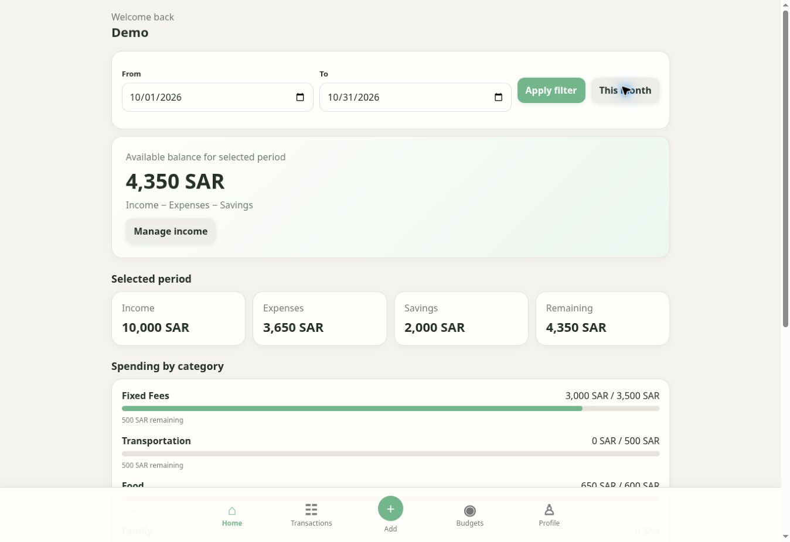
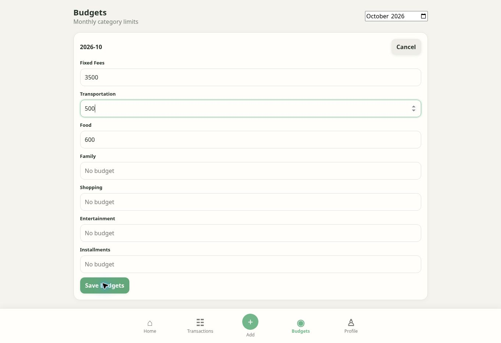
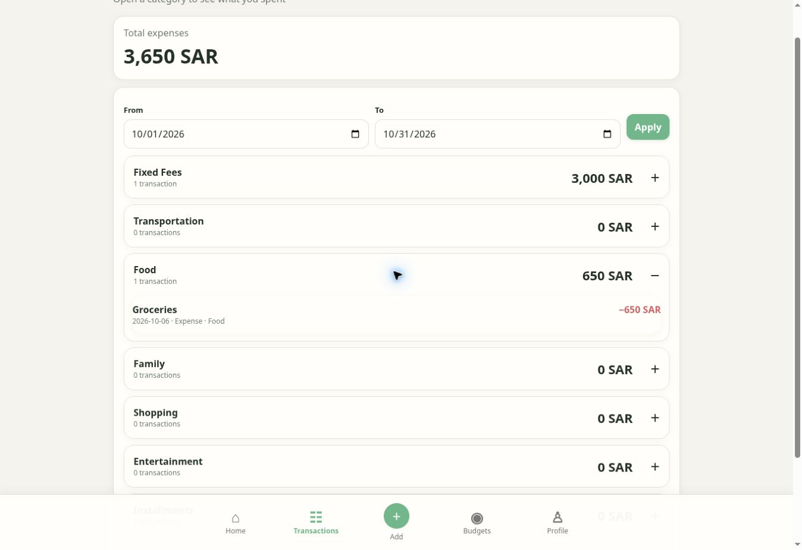

# Spendly

**Know what is left to spend after expenses and savings.**

[**Live Demo →**](https://hassansaber1911-dot.github.io/Spendly/)

A mobile-first budgeting prototype for people who want a clear money picture without maintaining a spreadsheet.

## Product Preview

Real screenshots from the live application using sample data.

### Income, expenses and savings in one view

### Set category budgets deliberately

### Inspect the transactions behind a total

## The problem
Money is scattered across bank apps, notes and memory. The user needs to know what they earned, spent, saved and still have available.

## MVP and user flow
Onboard → add income → record expenses or savings → set optional budgets → review the dashboard and transaction history.

- Multiple income entries with optional sources.
- Expenses by date, category and reusable subcategory.
- Savings tracked separately from spending.
- Category budgets and over-budget visibility.
- Date filters and transaction editing.

## Business rules and product decisions
**Available balance = Income − Expenses − Savings.** Savings reduce spendable money without inflating expenses.

**Setup happens in context.** New subcategories are remembered when a transaction is entered; a separate category-management screen is unnecessary for this MVP.

**Budgets are optional.** Users can start with tracking and add limits later.

**Local data keeps the experiment small.** Records persist in this browser, making the core loop testable before investing in accounts and synchronization.

## Measurement
GA4 events are implemented for onboarding, income changes, expense/savings entry, budget saves, date filters and category expansion. These are instrumentation hooks, not evidence of adoption or improved financial outcomes. User names, notes and free-text sources are excluded from event parameters.

## Current limits
Browser-local data; no cloud sync, bank connections or payment processing. This is a working prototype, not a financial service.

## Validation
Live flow checked on 6 October 2026 with synthetic data: income **10,000 SAR**, expenses **3,650 SAR**, savings **2,000 SAR** → available balance **4,350 SAR**. Category budget editing and transaction review were exercised. Onboarding and timezone-related month calculations were repaired during this review.

---
Built by **Hassan Mohamed Saber** · Product portfolio
